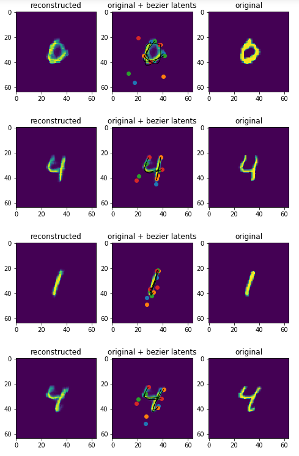

This is an implementation of [Canvas-Drawer network training architecture](https://arxiv.org/abs/1809.08340) in Pytorch.

The models trained with this method can learn reconstruction techniques to reconstruct data using black-box data-generating programs, without paired data.
This is achieved by training a "canvas" model to approximate the generative tool's behavior,
 and using this model as a differentiable loss function for a "drawer" model that outputs control sequences for the data-generating program.

Like an autoencoder, the overall model learns a latent representation of target data.
However, this representation is useful - it approximates the control space of the original data-generating program, and can be used to drive it.

The archetypical example is vectorized recreation of sketch drawings using bezier curves.
A canvas learns to render bezier curves to images.
A drawer learns to reconstruct images using bezier curve coordinate vectors.

Currently a WIP, but the models are implemented and training converges for the paper's MNIST generation task.
CPU training is not yet supported but simply requires refactoring.

After training for 15 minutes (canvas) and 3 hours (drawer) using GTX 1080Ti on MNIST:

